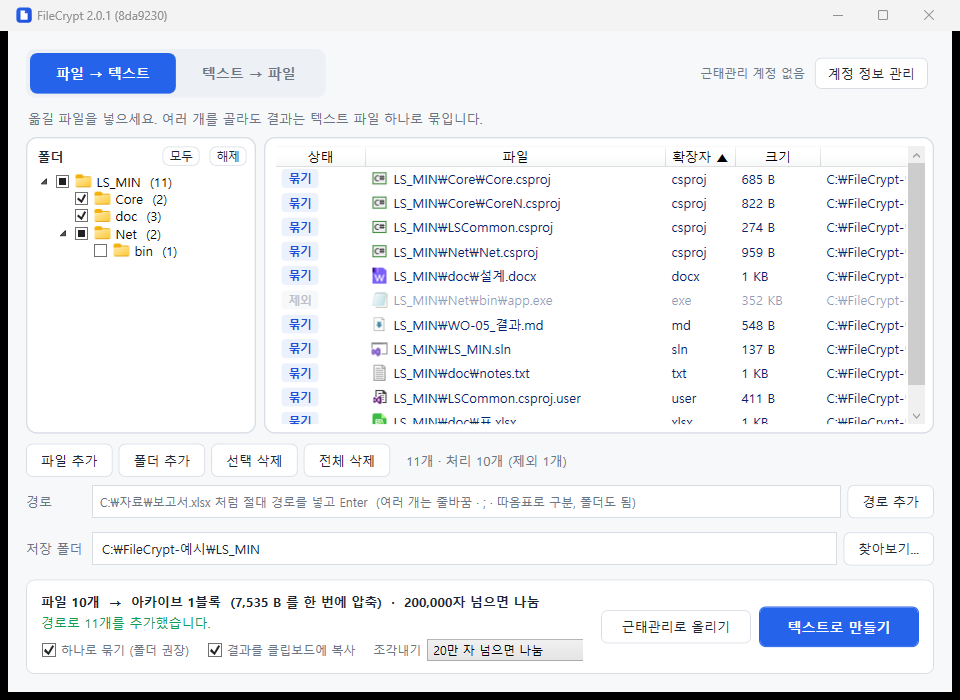

# 파일 넣기와 고르기

[← 위키 처음](Home.md)

## 넣는 방법

| 방법 | 하는 법 |
|---|---|
| 끌어 놓기 | 탐색기에서 파일·폴더를 가운데 목록으로 끌어 놓습니다 |
| 버튼 | **[파일 추가]** · **[폴더 추가]** |
| **경로 입력** | 아래 **경로** 칸에 절대 경로를 넣고 **Enter** (또는 **[경로 추가]**) |

폴더를 넣으면 그 안의 파일이 하위 폴더까지 전부 들어가고, 폴더 구조는 결과에 그대로 남습니다.
폴더를 넣으면 **[하나로 묶기]** 가 자동으로 켜집니다(훨씬 작아짐).

### 경로 입력

- 여러 개는 **줄바꿈** · **`;`** 로 나눕니다. 줄을 바꾸려면 **Shift+Enter**.
- 탐색기에서 파일을 골라 **"경로로 복사"** 한 것(따옴표로 감싸진 여러 줄)을 그대로 붙여넣어도 됩니다.
- `%USERPROFILE%\Documents\a.txt` 처럼 환경변수를 써도 됩니다. `/` 로 써도, 폴더 끝에 `\` 가 붙어도 괜찮습니다.
- **`C:\…` 나 `\\서버\…` 로 시작하는 절대 경로만** 받습니다. `a.txt`, `.\a.txt`, `C:a.txt`, `\a.txt` 는 어디를 뜻하는지 모호해 받지 않습니다.
- 없는 경로나 받지 않는 경로는 상태줄에 이유가 나오고 **그 경로만 칸에 남습니다** — 고쳐서 다시 Enter.
- 이미 목록에 있는 파일은 다시 넣지 않습니다.

## 왼쪽 폴더 트리 — 일부만 고르기

"파일 → 텍스트" 탭에 파일을 넣으면 왼쪽에 **폴더** 패널이 나타납니다. 넣은 파일들의 폴더 구조이고,
**체크한 폴더의 파일만** [텍스트로 만들기] · [근태관리로 올리기] 에 들어갑니다.

| 하고 싶은 것 | 하는 법 |
|---|---|
| 빌드 산출물(`bin`, `obj`) 빼기 | 그 폴더의 체크를 끕니다 |
| 하위까지 한 번에 | 상위 폴더 체크를 끄거나 켜면 하위 폴더도 함께 바뀝니다 |
| 일부만 남기기 | **[해제]** 로 전부 끈 뒤 필요한 폴더만 켭니다 |
| 다시 전부 | **[모두]** |
| 키보드로 | 트리에서 폴더를 고르고 **Space** |

- 체크 표시: ☑ 전부 처리 · ☐ 전부 제외 · ■ 일부만. ■ 를 누르면 전부 켜집니다.
- 끈 폴더의 파일은 **지워지지 않고** 목록에 흐리게 **"제외"** 로 남습니다. 다시 켜면 돌아옵니다.
- 파일 수 표시가 "11개 · 처리 10개 (제외 1개)" 처럼 바뀌고, 실행 버튼 위 계획 줄(파일 수·크기)도 처리할 파일 기준입니다.
- 파일을 더 넣어도 꺼 둔 폴더는 꺼진 채로 둡니다. **[전체 삭제]** 하면 잊습니다.
- 맨 위는 겹치는 앞부분(`C:\Users\…`)을 건너뛰고 파일이 처음 나오는 폴더부터 보입니다. 폴더에 마우스를 올리면 전체 경로가 보입니다.
- 폴더 패널 폭은 목록과의 경계선을 끌어 바꿉니다.
- "텍스트 → 파일" 탭에는 폴더 패널이 없습니다(조각 일부를 빼면 되돌리기가 깨지므로).

## 정렬

목록의 **열 머리글**(상태 · 파일 · 확장자 · 크기 · 위치)을 누르면 그 기준으로 정렬하고, 다시 누르면 반대로 정렬합니다.
지금 기준은 머리글의 ▲(오름) / ▼(내림)로 보입니다.

- 같은 값끼리는 파일 이름순입니다.
- 크기는 실제 바이트 수로 비교합니다(화면의 "3 KB", "400 B" 글자가 아니라).
- 정렬은 보이는 순서만 바꿉니다. 결과물은 같습니다.
- 탭마다 따로 기억하고, 나중에 넣은 파일도 정렬된 자리에 들어갑니다.

## 아이콘

폴더와 파일 아이콘은 **탐색기와 같은 것**을 Windows 에서 받아 씁니다. 그 PC 에 설치된 프로그램에 따라 탐색기와 똑같이 보입니다
(예: `.csproj` 는 Visual Studio 가 있으면 C# 아이콘). `.exe` · `.ico` · `.lnk` 는 파일마다 자기 아이콘이 나옵니다.
